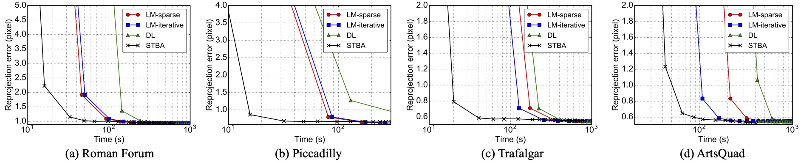
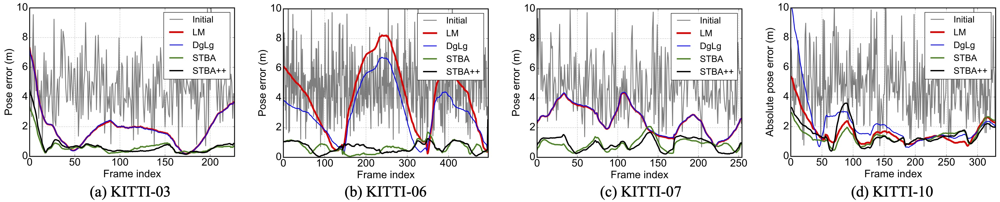
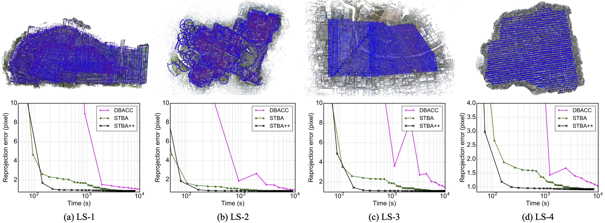

# STBA
This is a C++ implementation of "Stochastic Bundle Adjustment for Efficient and Scalable Structure from Motion".

## About


### Benchmark on [1DSfM dataset](http://www.cs.cornell.edu/projects/1dsfm/)



### Benchmark on [KITTI dataset](http://www.cvlibs.net/datasets/kitti/eval_odometry.php)



### Benchmark on Large-Scale dataset



## Usage

### Requirements

* Eigen3
* OpenMP 

### Build
 
 ```
 cd STBA
 mkdir build && cd build
 cmake ..
 make
 ```

### Run

* Download the sparse reconstruction results of the [COLMAP dataset](https://colmap.github.io/datasets.html) (e.g., Gerrard Hall)
* Unzip the compressed file and three files can be found in the `sparse` folder: `cameras.txt`, `images.txt` and `points3D.txt`.
* ``` cd STBA/build ```
* ``` ./STBA <path_to_cameras.txt> <path_to_imagess.txt>  <path_to_points3D.txt> <output_folder>```
* Run ```./STBA --help``` to see more options


## Credit

This implementation was developed by [Lei Zhou](https://zlthinker.github.io/). Feel free to contact Lei for any enquiry.